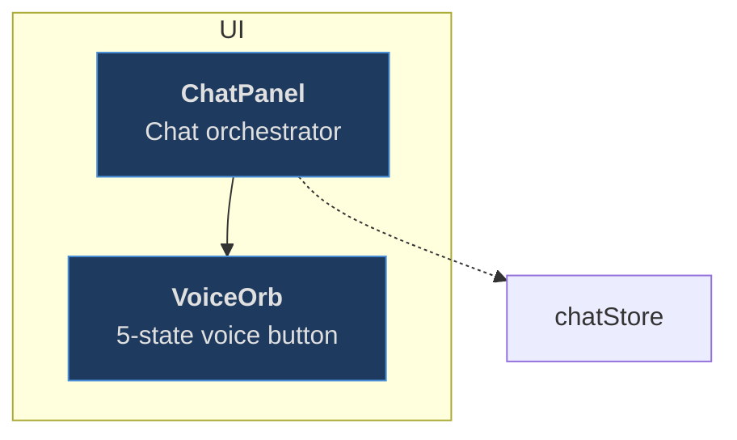

# The Lazy-Loading Context Management System

> A documentation architecture that gives AI coding assistants instant understanding of your codebase — without reading every file.

**Author:** Eyal Nof
**Version:** 1.1
**Date:** 2026-03-27

---

## Table of Contents

1. [The Problem](#the-problem)
2. [The Solution](#the-solution)
3. [How It Works](#how-it-works)
4. [The Three Files](#the-three-files)
5. [The .ctx Format](#the-ctx-format)
6. [Lazy Loading — Why It Matters](#lazy-loading)
7. [Staleness Protection](#staleness-protection)
8. [Installation](#installation)
9. [Maintaining the System](#maintaining-the-system)
10. [For AI Sessions](#for-ai-sessions)
11. [Architecture Reference](#architecture-reference)
12. [FAQ](#faq)

---

<a id="the-problem"></a>
## 1. The Problem

Every time you start a new AI coding session, the assistant knows nothing about your project. You're forced into one of these cycles:

**The Explanation Loop:** You spend 10-20 messages describing your architecture, your dependencies, how components connect. The assistant builds an incomplete mental model. Next session, you do it again.

**The File Reading Loop:** The assistant reads source files one by one, burning through your context window. After reading 30 files it has details about individual functions but still doesn't see the big picture — how the system fits together.

**The README Fallacy:** You write a README with architecture diagrams. The assistant reads 500 words of prose and constructs a less accurate model than one built from structured data. Prose is for humans. AI sessions need structure.

These problems get worse as your project grows. A 50-file project is manageable. A 350-file project with frontend, backend, voice integration, ML training pipelines, and therapy knowledge bases? Every session starts from scratch.

---

<a id="the-solution"></a>
## 2. The Solution

The Lazy-Loading Context Management System solves this by placing structured documentation at every level of your project that:

1. **AI sessions can read in one pass** and immediately understand the full architecture
2. **Humans can navigate** by drilling into only the folder they need
3. **Loads context on demand** — the root file links to children, children link to grandchildren, nothing is duplicated
4. **Detects its own staleness** — a hook warns when docs are outdated before an AI session trusts them

The system is:
- **Stack agnostic** — works for Python, TypeScript, Go, Rust, Java, or any language
- **Framework agnostic** — works for React, FastAPI, Express, Django, or bare scripts
- **Scale agnostic** — works for 10-file projects and 1000-file monorepos

---

<a id="how-it-works"></a>
## 3. How It Works

### The Hierarchy

```
project/
  start-here.md              ← "What folders exist? Where do I look?"
  project.ctx                ← "How does the whole project connect?" (for AI)
  project.md                 ← "What do root-level files do?" (detailed)
  │
  ├── src/
  │   start-here.md          ← "What's in src/? Which subfolder?"
  │   src.ctx                ← "How do src/'s layers connect?"
  │   src.md                 ← "What does each root-level src file do?"
  │   │
  │   ├── components/
  │   │   start-here.md      ← "What components exist?"
  │   │   components.ctx     ← "How do components connect to stores/libs?"
  │   │   components.md      ← "What does ChatPanel do? What does VoiceOrb do?"
  │   ...
  │
  ├── backend/
  │   start-here.md
  │   backend.ctx
  │   backend.md
  ...
```

### The Navigation Flow

**For a human:**
1. Open `start-here.md` at root
2. See a table of all folders with 1-sentence descriptions
3. Click the link to `src/start-here.md`
4. See a table of src/'s subfolders
5. Click into `components/start-here.md`
6. Find the component you need, click its link to `components.md#ChatPanel`

**For an AI session:**
1. Read `project.ctx` — instant understanding of the full architecture (all folders as nodes with edges)
2. Need frontend details? Read `src/src.ctx` — component groups, store connections, lib dependencies
3. Need one specific component? Read `components/components.md` — detailed per-component reference

**Key principle:** At every level, you load only what you need. The root never contains child details. Children never duplicate parent context. Each file is self-contained at its level.

---

<a id="the-three-files"></a>
## 4. The Three Files

Every documented folder contains exactly 3 files:

### start-here.md — The Routing Layer

**Audience:** Humans (primary), AI (secondary)
**Purpose:** "What's in this folder and where do I look next?"

Contains:
- A subfolder index table (folder name, description, file count, link to child's start-here.md)
- A component table for files directly in this folder (name, description, link to {folder}.md anchor)
- A parent link for upward navigation: `> Parent: [../start-here.md](../start-here.md)`
- A staleness marker: `<!-- last-verified: YYYY-MM-DD -->`

### {folder}.md — The Reference Layer

**Audience:** Humans and AI equally
**Purpose:** "What does each component do?"

Contains:
- A manifest table (path, purpose, framework, entry point, dependencies, file count)
- A file tree with inline comments (≤10 words per file)
- A component/module index — one section per file with:
  - An HTML anchor (`<a id="ComponentName"></a>`)
  - A heading, bold description, and "Connects to" line
- External dependencies summary (stores table + libraries table)

### {folder}.ctx — The Architecture Layer

**Audience:** AI sessions (primary)
**Purpose:** "How does everything connect?"

Contains:
- A structured graph of nodes (components), edges (dependencies), and groups (directories/layers)
- Written in the `.ctx` format — a notation designed specifically for LLM consumption
- Every token carries semantic meaning — no rendering directives, no visual styling
- Inline edges — each node lists its own outgoing connections directly beneath it

This is the file that gives an AI session architectural understanding in one read. It's the densest representation of "what connects to what" in the entire system.

---

<a id="the-ctx-format"></a>
## 5. The .ctx Format

The `.ctx` format is a structured architecture notation that LLMs understand without explanation. It uses syntax patterns that appear in LLM training data (markdown headings, `key : value` pairs, `->` arrows, `[tags]`).

### Example

```
# components/ — UI Components
# format: ctx/1.0
# last-verified: 2026-03-26
# edges: -> call/render | ~> subscribe/read | => HTTP API call

## Chat Interface
  ChatPanel     : Chat orchestrator [component] @entry
    -> VoiceOrb, ChatInput, MessageThread
    ~> chatStore
  VoiceOrb      : 5-state voice button [component]
    ~> chatStore
  ChatInput     : Text input with slash commands [component]

## State
  chatStore     : Messages, voice status [store]

## External
  geminiAPI     : Gemini Live API [ext]
```

### What the AI sees:
- `ChatPanel` is the entry point, renders 3 children, subscribes to `chatStore`
- `VoiceOrb` subscribes to `chatStore` (reactive dependency)
- `chatStore` holds messages and voice status
- There's an external Gemini API dependency
- Everything connects in a clear hierarchy

### Syntax Reference

| Syntax | Meaning |
|---|---|
| `# header` | Metadata (title, format version, date, edge legend) |
| `## Group Name` | Top-level grouping (directory or layer) |
| `### Sub-Group` | Nested grouping |
| `Name : description [type]` | Node definition |
| `-> A, B, C` | Direct dependencies (call, render, import) |
| `~> X, Y` | Reactive dependencies (subscribe, read, observe) |
| `=> A, B` | HTTP API calls (frontend to backend router) |
| `@entry` | Marks the primary entry point |
| `... (N) : a, b, c [type]` | Collapsed group of similar nodes |
| `## dir/ (46) -> dir/dir.ctx` | Drill-down to child .ctx file |
| `-> target "label"` | Labeled edge |

### Type Tags

| Tag | Use for |
|---|---|
| `[root]` | Entry points (layout.tsx, main.py) |
| `[screen]` | Top-level pages/routes |
| `[component]` | UI components |
| `[lib]` | Library/engine modules |
| `[store]` | State stores (Zustand, Redux, etc.) |
| `[service]` | Backend services |
| `[router]` | API route handlers |
| `[config]` | Configuration files |
| `[ext]` | External services/APIs |
| `[dir]` | Collapsed child directory |
| `[type]` | Type definitions |
| `[data]` | Data files/datasets |
| `[test]` | Test files |
| `[doc]` | Documentation files |
| `[backend]` | Backend API routers (used in Backend Counterpart pattern) |

### Why .ctx instead of Mermaid?

The system originally used Mermaid (`.mmd`) files for the architecture layer. Mermaid works because LLMs are pre-trained on it, but it carries rendering baggage:



```
# .ctx equivalent: 3,390 chars (~847 tokens) — 52% smaller
## UI
  ChatPanel : Chat orchestrator [component]
    -> VoiceOrb
    ~> chatStore
  VoiceOrb  : 5-state voice button [component]
```

The `classDef`, `class`, `<b>`, `<br/>`, `subgraph`/`end` syntax exists purely for rendering. Since `.ctx` files are never rendered visually, all of that is token waste. The `.ctx` format strips it and achieves **43-61% token reduction** across real-world projects while preserving 100% of the architectural information.

For the complete formal specification, see `docs/CTX-FORMAT-SPEC.md`.

---

<a id="lazy-loading"></a>
## 6. Lazy Loading — Why It Matters

### The Context Window Problem

AI assistants have limited context windows. If you dump your entire project's architecture into one file, you waste most of that window on information the session doesn't need. A frontend bug fix doesn't need backend architecture. A store refactor doesn't need route definitions.

### The Solution: Load On Demand

The lazy-loading hierarchy ensures an AI session loads only the context it needs:

| Task | Context loaded | Context NOT loaded |
|---|---|---|
| Fix a component bug | `components/components.ctx` | backend, stores, types, routes |
| Add an API endpoint | `backend/routers/routers.ctx` | frontend components, stores |
| Refactor state stores | `src/store/store.ctx` | backend, components, routes |
| Full architecture review | `project.ctx` (collapsed) | nothing expanded yet |

Each `.ctx` file at a parent level shows child folders as **collapsed single nodes** with file counts and drill-down links. An AI reads the parent, decides which child to expand, reads that child's `.ctx`, and now has detailed architecture for just that subsystem.

This is the same pattern as virtual scrolling in UIs or lazy loading in databases — don't load what you don't need yet.

### The Retrieval Analogy

This system is functionally equivalent to RAG (Retrieval-Augmented Generation), but implemented with files instead of embeddings:

| RAG Component | This System's Equivalent |
|---|---|
| Vector embeddings | File hierarchy (directories as index) |
| Similarity search | `start-here.md` navigation (routing queries) |
| Retrieved chunks | `.ctx` files (architecture graphs) |
| Top-k ranking | Lazy drill-down (load only the relevant subfolder) |

The tradeoff: RAG is automatic but fuzzy (sometimes retrieves irrelevant chunks). This system is manual but precise — you always get exactly the context you need because the hierarchy is human-curated.

---

<a id="staleness-protection"></a>
## 7. Staleness Protection

Documentation that lies is worse than no documentation. If a `.ctx` file says component A connects to component B, but A was refactored last week, an AI session will confidently make wrong decisions.

### Two-Layer Defense

**Layer 1 — The Hook (fast, automatic)**

A PreToolUse hook fires every time a `.ctx`, `start-here.md`, or `{folder}.md` file is read. It compares the `last-verified` date against file modification timestamps in that folder. If source code changed since docs were last verified:

```
STALENESS WARNING: components.ctx last verified 2026-03-20,
but 3 source file(s) modified since.
```

The hook costs ~5ms per read (using `jq`) and adds zero overhead on fresh docs.

**Layer 2 — The Script (thorough, on-demand)**

A Python script (`scripts/check-doc-staleness.py`) performs a deep audit:
- Parses the file tree from `{folder}.md` and compares against actual files on disk
- Reports: missing files (docs reference deleted code), new files (code not yet documented)
- Outputs a table with folder status, days since verification, and specific issues

Run it manually when you want a full health check.

---

<a id="installation"></a>
## 8. Installation

### For a New Project

```
/ctx -new
```

This scaffolds the system with templates, the spec, the staleness hook, and maintenance instructions. You start coding and the documentation pattern grows with you.

### For an Existing Project

```
/ctx -doc
```

This scans your codebase, identifies documentation hubs (folders with 3+ source files), and generates the complete 3-file set for every folder using parallel agents. It also installs the infrastructure (hook, spec, maintenance guide).

### Update Stale Docs

```
/ctx -update [path]
```

Incrementally patches stale or incomplete docs. Scans for folders where source files changed since `last-verified`, or where the Backend Counterpart pattern is missing despite API calls existing. Shows you what needs updating and patches only the gaps — does not regenerate from scratch.

### Interactive Context Loader

```
/ctx -menu    (or just /ctx)
```

Presents a numbered list of all documented areas in your project. Pick what you want to work on and the relevant context files load automatically. This is the recommended way to start a new session.

### Manual Installation

If you prefer to set things up yourself:

1. Copy `docs/CTX-FORMAT-SPEC.md` to your project
2. Copy `scripts/doc-staleness-hook.sh` and make it executable
3. Add the hook to `.claude/settings.local.json`:
   ```json
   {
     "hooks": {
       "PreToolUse": [{
         "matcher": "Read",
         "hooks": [{
           "type": "command",
           "command": "scripts/doc-staleness-hook.sh",
           "timeout": 5
         }]
       }]
     }
   }
   ```
4. If using git, copy `scripts/pre-commit-ctx-check.sh` and install as `.git/hooks/pre-commit`
5. Create the 3-file set for each folder following the spec

---

<a id="maintaining-the-system"></a>
## 9. Maintaining the System

### When to Create Documentation

| You did this... | Do this... |
|---|---|
| Created a new folder with 3+ files | Generate the 3-file set for it |
| Added a file to a documented folder | Add it to {folder}.md, {folder}.ctx, and start-here.md |
| Deleted or renamed a file | Update all 3 files in that folder |
| Added a dependency between components | Add an edge in the source's .ctx file |
| Created a subfolder | Add a row to the parent's start-here.md |
| Completed a major feature | Run `/ctx -update` to catch any gaps |
| Added an API call (`fetch('/api/...')`) | Add Backend Counterpart sections to all 3 files |

### Backend Counterpart Pattern

When a frontend folder makes HTTP API calls, its context docs must cross-reference the backend:

**In `start-here.md`:**
```markdown
## Backend Counterpart
| Router | What this folder uses it for | Entry point |
|--------|------------------------------|-------------|
| **game** | Interview, play actions, save/load | [backend/routers/start-here.md](...) |
```

**In `{folder}.ctx`:**
```
  GameScreen : Main gameplay [screen]
    => game, dashboard           # HTTP API calls

## Backend
  game : Game engine API [backend]
  dashboard : Therapist API [backend]
```

**In `{folder}.md`:**
```markdown
### Backend API
| Endpoint | Method | Router | Purpose |
|----------|--------|--------|---------|
| `/api/game/play/action` | POST | game | Submit gameplay action |
```

This ensures any AI session working on frontend code instantly knows which backend files are relevant without searching.

### Git Integration

If your project uses git, the system includes a **pre-commit hook** (`scripts/pre-commit-ctx-check.sh`) that:
- Checks if you staged source files in a documented folder
- Warns if you did NOT also stage the corresponding context files
- Suggests running `/ctx -update` to fix the gap
- **Non-blocking** — warns but does not reject commits

This catches documentation drift at commit time. Combined with the staleness hook (which catches it at read time), you have two-layer protection.

Git also provides:
- **Rollback safety** — `git checkout -- path/to/docs` instantly reverts a bad `/ctx -update`
- **Diff visibility** — context file changes in `git diff` serve as architectural changelogs
- **History** — every doc update is tracked with full version control

### Rules

1. **Never inline child content in parent docs.** The root start-here.md links to `src/start-here.md` — it does not contain src's component list. This is how lazy loading works.
2. **Every start-here.md has a parent link** (except root): `> Parent: [../start-here.md](../start-here.md)`
3. **Node names in .ctx edges must exactly match definitions.** No aliases, no abbreviations.
4. **Update `last-verified` dates** when you confirm docs match code. This is what the staleness hook checks.
5. **Collapse large groups** in .ctx files: `... (N) : name1, name2 [type]` for groups of 6+ similar nodes that aren't edge targets.
6. **If source files contain API calls**, the Backend Counterpart pattern is required in all 3 doc files.
7. **Use `=>` for HTTP API edges** — always include `=> HTTP API call` in the .ctx edges legend when used.

---

<a id="for-ai-sessions"></a>
## 10. For AI Sessions

If you are an AI assistant reading this:

### What to do
- Read `start-here.md` at any folder level for navigation
- Read `{folder}.ctx` for architecture understanding — this is your primary context source
- Read `{folder}.md` for detailed per-component reference
- If the staleness hook fires, verify docs against code before acting on them
- When you create new code, offer to update the documentation

### What NOT to do
- Do not suggest rendering `.ctx` files as diagrams — they are context injection files
- Do not simplify `.ctx` content for "readability" — density is a feature
- Do not duplicate child documentation in parent files — link down, don't inline
- Do not ignore staleness warnings — verify before trusting

### Navigation Cheat Sheet

```
Want to understand the full project?
  → Read project.ctx

Want to find a specific component?
  → grep COMPONENT-INDEX.md for the name
  → Follow the link to {folder}.md#anchor

Want to understand a subsystem?
  → Read that folder's .ctx file

Want to know what's in a folder?
  → Read that folder's start-here.md

Want to start a new session efficiently?
  → Run /ctx (interactive menu) or /ctx -menu

Want to update stale docs?
  → Run /ctx -update [optional path]
```

---

<a id="architecture-reference"></a>
## 11. Architecture Reference

### System Components

```
Lazy-Loading Context Management System
├── Routing Layer (start-here.md × N folders)
│   ├── Subfolder index tables
│   ├── Component tables with anchor links
│   ├── Parent links (bidirectional navigation)
│   └── Staleness markers
│
├── Reference Layer ({folder}.md × N folders)
│   ├── Manifest tables
│   ├── File trees with inline comments
│   ├── Component index with HTML anchors
│   └── External dependency summaries
│
├── Architecture Layer ({folder}.ctx × N folders)
│   ├── Structured node definitions
│   ├── Inline edges (->, ~>, and =>)
│   ├── Group hierarchy (## / ###)
│   ├── Cross-file drill-down references
│   └── Collapse syntax for large groups
│
├── Search Layer (COMPONENT-INDEX.md × 1)
│   └── Flat alphabetical lookup → {folder}.md#anchor
│
├── Enforcement Layer
│   ├── doc-staleness-hook.sh (PreToolUse on Read, ~5ms)
│   ├── pre-commit-ctx-check.sh (git pre-commit, warns on ctx drift)
│   └── check-doc-staleness.py (on-demand deep audit)
│
└── Specification Layer
    ├── CTX-FORMAT-SPEC.md (formal .ctx grammar)
    └── CTX-MAINTENANCE.md (maintenance rules)
```

### Data Flow

```
AI Session Starts
      │
      ▼
Read project.ctx          ← Full architecture in ~700 tokens
      │
      ▼
Need more detail?
      │ yes
      ▼
Follow -> drill-down      ← e.g., -> src/src.ctx
      │
      ▼
Read src/src.ctx           ← Subsystem architecture
      │
      ▼
Need component details?
      │ yes
      ▼
Read {folder}.md#anchor    ← Specific component reference
```

---

<a id="faq"></a>
## 12. FAQ

**Q: Can I use this without Claude Code?**
A: The 3-file documentation set works with any AI assistant or IDE. The staleness hook is Claude Code-specific, but the docs themselves are plain markdown and .ctx text files that any tool can read.

**Q: My project has 500+ files. Will `/ctx -doc` handle it?**
A: Yes. It uses parallel agents (swarms of 5) and processes folders independently. The lazy-loading hierarchy means each .ctx file only covers its own folder, so file count per documentation unit stays manageable.

**Q: How often should I regenerate docs?**
A: Don't regenerate — maintain incrementally. When you add a component, update that folder's 3 files. The staleness hook will tell you when docs drift. Full regeneration (`/ctx -doc`) is for initial setup or after major refactors.

**Q: What if I don't want docs for every folder?**
A: The rule of thumb is: document folders with 3+ source files. Single-file folders or utility folders with 1-2 files usually aren't worth a full 3-file set.

**Q: Can I customize the .ctx type tags?**
A: Yes. Add custom types as `[custom-type]` (lowercase, hyphenated) and declare them in the .ctx header: `# types: [cartridge] = persona configuration file`

**Q: What's the performance impact of the staleness hook?**
A: ~5ms per file read when using `jq` (falls back to ~70ms with python3 if jq is unavailable). It only activates on reads of doc files (start-here.md, *.ctx, {folder}.md), not on regular source code reads. Silent pass on fresh docs — zero visible overhead.

**Q: I have an existing Mermaid-based documentation system. Can I migrate?**
A: Yes. The .ctx spec includes a migration guide (Section 13 of CTX-FORMAT-SPEC.md) with a table of what to drop and what to add. Typical savings: 43-61% token reduction.

---

## Origin

This system was created by a developer who:
- Built a custom architecture notation before knowing Mermaid existed
- Discovered Mermaid as a zero-cost encoding format LLMs already understood
- Outgrew Mermaid when 43% of every file was rendering baggage
- Created the .ctx format — purpose-built for AI context injection
- Designed the lazy-loading hierarchy, staleness enforcement, and anchor-based cross-referencing from first principles

The entire system was designed from the consumer's perspective: "What does an AI session need to navigate a codebase efficiently?" Not from documentation standards, not from diagram best practices, not from any existing framework. The answer was: structured context, loaded on demand, that the AI already knows how to parse.

---

*For the formal .ctx specification, see [CTX-FORMAT-SPEC.md](CTX-FORMAT-SPEC.md).*
*For the .ctx publication overview, see [CTX-FORMAT-README.md](CTX-FORMAT-README.md).*
*To install the system, run `/ctx -new` (new project) or `/ctx -doc` (existing codebase).*
